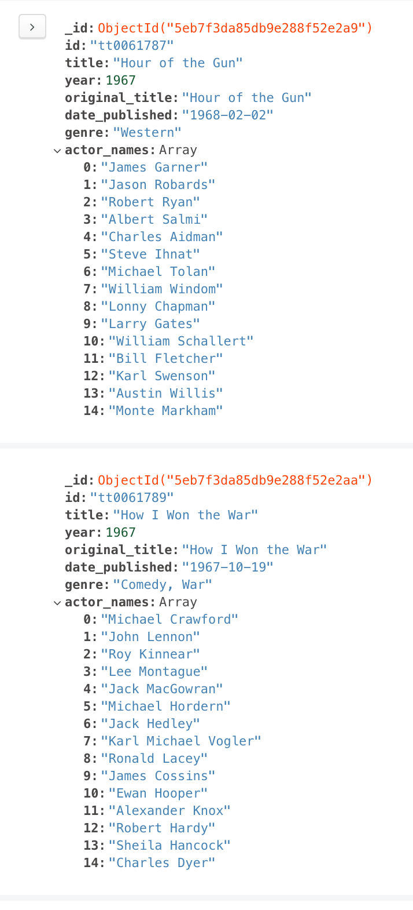
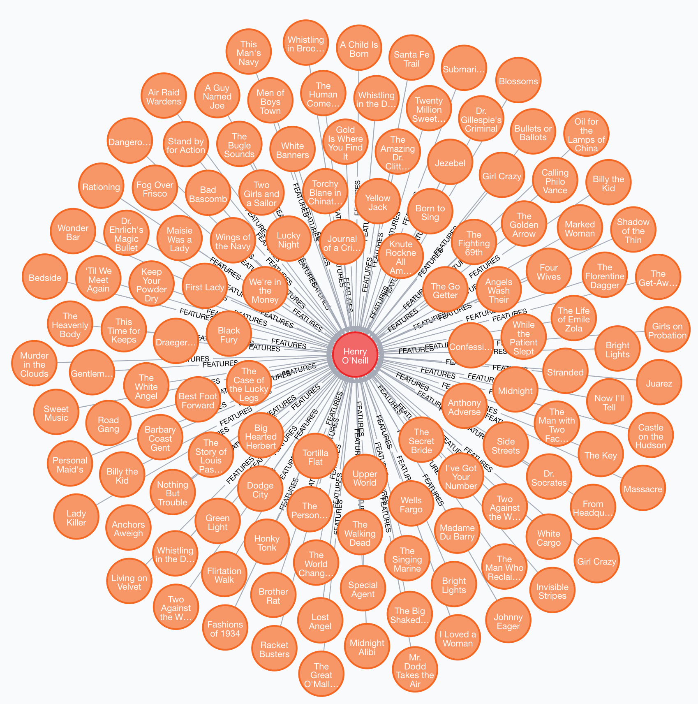
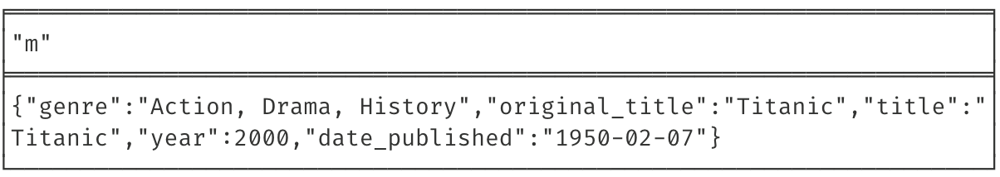

# DB-Mini-Project2

### Assignment link
[Mini Project 2: NoSQL Databases](https://datsoftlyngby.github.io/soft2020spring/resources/b27d96f6-MP2.pdf)

### Group:
* Pernille Lørup
* Adam Lass
* Rasmus Helsgaun

## Database choices:
* Neo4j
* MongoDB

## Dataset
The dataset being used in this assignment is an IMDB movie dataset downloaded from [kaggle](https://www.kaggle.com/stefanoleone992/imdb-extensive-dataset#IMDb%20movies.csv), and is a csv file that contains a little over 81.000 movies.  

## Assignment

*Your task is to select two or more databases of different NoSQL types and to compare their features
and performance in storing, scaling, providing, and processing big data.*

### Your solution includes

### 1) preparing a large data source and loading it into both databases

We chose to implement a python script that loads both datasets into our chosen databases. 

**Neo4j**:  

```python
for k,v in movies.iterrows():
    id = v.imdb_title_id
    title = v.title
    year = v.year
    original_title = v.original_title
    date_published = v.date_published
    genre = v.genre
    try:
        actor_names = v.actors.split(",")
    except:
        actor_names = []
        
    result = session.run("CREATE(m:Movie { title:$title, year:$year, original_title:$original_title , date_published:$date_published, genre:$genre }) RETURN m",
                        title=title, year=year, original_title=original_title, date_published=date_published, genre=genre)
    result = result.single()[0]
    
    for actor_name in actor_names:
        actor_name = actor_name.strip()
        match = session.run("match (a) WHERE a.name=$name return a",name=actor_name)
        if match.peek() == None:
            match = session.write_transaction(lambda tx, name: tx.run("CREATE(a:Name { name:$name } )RETURN a", name=name), actor_name)
        
        match = match.single()[0]
        result1 = session.run("""
            MATCH (name: Name{ name:$name })
            MATCH (movie: Movie{ title: $title })
            CREATE (movie)-[r1:FEATURES]->(name)
        """, name=actor_name, title=title)
 
``` 

Because the movie dataset contained several redundant columns, we made the decision to only include the columns: id, title, year, original title, date published, genre, and actor names.  
After deciding which columns we wanted to include, we also chose to only load 5000 rows because Neo4j is not loading large datasets very fast. With that being said, when the data has been loaded it works very well and is easy to use. 

After approximately 17 minutes of loading the dataset it had the size of 199,96 MB. 
One of the great features of using Neo4j is the visualization of the data. 

The visualization below shows 25 movies and their featured actors. 


We also tried to visualize 3000 movies and their featured actors which looked like this: 


**MongoDB**:  

```python

for k,v in movies.iterrows():
    id = v.imdb_title_id
    title = v.title
    year = v.year
    original_title = v.original_title
    date_published = v.date_published
    genre = v.genre
    try:
        actor_names = v.actors.split(",")
        actor_names = list(map(lambda an: an.strip(), actor_names))
    except:
        actor_names = []
    
    actor_docs = []
    
    for actor in actor_names:
        search = name.find_one({"name": actor})
        if search == None:
            res = name.insert_one({
                "name": actor
            })
            
            actor_id = res.inserted_id
            
        else:
            actor_id = search["_id"]

        actor_docs.append(actor_id)
    
    movie.insert_one({
        "id":id,
        "title":title,
        "year": year,
        "original_title": original_title,
        "date_published": date_published,
        "genre": genre,
        "actors": actor_docs
    })
    
    for actor_name in actor_names:
        actor_name = actor_name.strip()


```
 
It took about 7 minutes to CREATE the dataset in MongoDB which was an improvement to the Neo4j solution! The database contained 2.44 MB of data. 

MongoDB doesn't have the same kind of visualization as Neo4j, but the data is listed as below in the Compass GUI. 




#### 2) 
- selecting relevant database operations, which can be used to compare the databases
- selecting appropriate criteria for comparison, such as access time, storage space,
complexity, versioning, security, or similar
- creating demo code for testing the selected database operations against the selected
comparison criteria  
- reporting the results and conclusions.


____  

**Get most featured actor:**

*Neo4j* 

```
MATCH (a)-[:FEATURES]->(m)
RETURN m, COLLECT(a) as actor
ORDER BY SIZE(actor) DESC LIMIT 1
```

This query took **4.55 ms** to run but a few seconds to get visualized.  




*MongoDB*  

```python
res = movie.aggregate([
    { "$unwind": "$actors" },
    { "$group": {
        "_id": "$actors",
        "total": {"$sum" : 1}
    }},
    { "$sort": { "total": -1 } },
    { "$limit": 1 }
])
```

This query took **286 ms** to run.  

___

**Update year on movie 'Titanic':**

*Neo4j*

```cql
MATCH(m:Movie { title:"Cleopatra" })
SET m.year = 2000
RETURN m
```

This query took **2.69 ms** to run and is visualized below:




*MongoDB*

```python
movie.update_one(
	{"title": "Titanic"}, 
	{"$set":{"year":2001}}
);
```

This query took **10.1 ms** to run.  

___

**Delete movie Titanic:**

*Neo4j*

```cql
MATCH (m:Movie  {title: "Titanic"})
DETACH DELETE m
``` 

This query took **3.27 ms** to run.


*MongoDB*  

```sql
movie.delete_one({
    "title":"Titanic"
})

```
This query took **5.73 ms** to run

___

#### CAP/ACID
...

[mongodb reference:](https://mongodbforabsolutebeginners.blogspot.com/2016/06/acid-and-cap-theroems.html)  

[neo4j reference:](https://neo4j.com/blog/acid-vs-base-consistency-models-explained/) 

...


____

### Conclusion

From the perspective of storage space and big data, MongoDB takes the lead as the entire document database only contained 2.44 MB and Neo4j's Graph structure contained 199.96 MB. From the dataset, we only made use of 5000 movies, so using all of it would take a lot of storage space if Neo4j was the database being used.  

When inserting the data from the CSV file, Neo4j was slower due to its method of storing data in the graph and creating relations between the nodes. Natively it uses indexing to being able to search directly in the properties. In the case of MongoDB it doesn't have this behaviour by default which means that it generally uses less space.

However when the data is in Neo4j it is overall faster at all the different tested operations such as get, update and delete in the graph structure, compared to MongoDB's Document collections. 

Overall if storage space is in your main concern, you should probably consider using mongoDB over Neo4j when storing your big data. However Neo4j comes with huge benefits when searching in complex relational data that can be presented in a graph structure. It really depends on the situation.  


